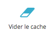

# Création d'une boutique en ligne avec Prestashop pour la brasserie artisanale de la pleine lune.
----
## Création de la boutique directement en ligne puis récupération en local.
----
utilisation du tuto pour la migration en local : [link](https://www.prestashop.com/forums/topic/519979-tutorial-comment-transf%C3%A9rer-mon-site-local-distant-ou-linverse/)
Copie du tuto et drop de la BDD dans le dossier fichiers_perso

----
## Modification des mention "état" dans le BO et le FO
----
utilisation du tuto : [link](https://www.team-ever.com/prestashop-1-6-ajouter-des-etats-de-produits/)

Copie du tuto dans le dossier fichiers_perso

**Avec les modifications suivantes :**

Dans la BDD, PhpMyAdmin ne permet pas de modifier la mention "condition" des tables product et product_shop.

il faut donc faire un export de ses 2 tables, les modifier et ensuite les réécrire par une requête SQL en modifiant les lignes adhéquats. (voir : commande_SQL_etat_prestashop.sql)

les fichiers : 
 - informations.tpl de */votre_admin/themes/default/template/controllers/products*
 - product.php      de */classes/*
 - product.tpl      de */themes/votre_theme*

sont à modifier comme indiqué dans le tuto.

### Enfin il faut penser à vider le cache sur le BO

Paramètres avancés => performances => icone vider le cache

